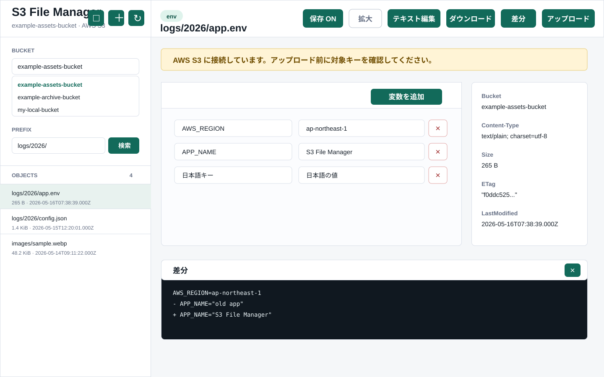

# S3 File Manager

S3 または MinIO / MiniStack などの S3 互換サービスにあるファイルを、ローカルから確認・ダウンロード・編集・アップロードするための CLI / Web UI ツールです。

ブラウザに AWS キーを渡さず、localhost の Node サーバーが AWS SDK 経由で S3 にアクセスします。Web UI は `127.0.0.1` のみで待ち受け、起動直後は読み取り専用です。



## 主な機能

- バケット検索と切り替え
- Prefix 検索とサジェスト
- オブジェクト一覧、メタデータ確認、画像プレビュー
- テキストファイルの表示・編集・差分確認・アップロード
- `.env`, `.env.local`, `*.env` の key/value 編集
- CLI での `list`, `get`, `show`, `diff`, `edit`, `put`
- 認証期限切れ時の S3 クライアント再作成と1回リトライ
- MinIO / MiniStack などの S3 互換エンドポイント対応

## クイックスタート

```bash
cd tools/s3-file-manager
npm install
npm run build
npm run web
```

起動後、ブラウザで開きます。

```text
http://127.0.0.1:5174
```

AWS S3 を使う場合は、AWS CLI / AWS SDK が読める認証情報を先に用意してください。

```bash
aws configure
aws sts get-caller-identity
```

プロファイルを使う場合:

```bash
export AWS_PROFILE=your-profile
npm run web
```

## Web UI

通常起動では読み取り専用です。ファイルを新規作成・保存する場合は、画面右上の `保存 OFF` を押して保存を有効にします。

起動直後から保存を有効にしたい場合:

```bash
npm run web -- --allow-write
```

バケット作成も起動直後から許可したい場合:

```bash
npm run web -- --allow-write --allow-create-bucket
```

ポートを変えたい場合:

```bash
npm run web -- --port 5175
```

対象バケットやリージョンを固定したい場合:

```bash
npm run web -- --bucket your-bucket-name --region ap-northeast-1
```

Web UI でできること:

| 操作 | 内容 |
| --- | --- |
| バケット検索 | 認証情報で参照できるバケットを検索・切り替えします |
| Prefix検索 | 表示中のオブジェクトから Prefix 候補を作り、検索を補助します |
| 一覧表示 | Prefix で絞り込んで S3 オブジェクトを表示します |
| メタデータ確認 | Content-Type、サイズ、ETag、更新日時を表示します |
| 保存モード切り替え | 起動中に `保存 OFF` / `保存 ON` を切り替えます |
| 新規ファイル作成 | 保存ONの時に、現在の Prefix をもとにテキストファイルを作成します |
| テキスト編集 | JSON、CSV、Markdown、YAML などをブラウザ上で編集します |
| env編集 | `.env`, `.env.local`, `*.env` を key/value テーブルまたは通常テキストとして編集します |
| 差分確認 | 開いた時点の内容と現在の編集内容を比較します |
| 画像プレビュー | JPEG、PNG、WebP、GIF を表示します |
| バケット作成 | 保存ONまたは `--allow-create-bucket` 指定時にバケットを作成します |

## CLI

```bash
npm run s3 -- list
npm run s3 -- list logs/
npm run s3 -- head logs/example.json
npm run s3 -- get logs/example.json
npm run s3 -- show logs/example.json
npm run s3 -- diff logs/example.json
npm run s3 -- edit logs/example.json
npm run s3 -- put logs/example.json
```

| コマンド | 用途 |
| --- | --- |
| `list [prefix]` | オブジェクト一覧を表示します |
| `head <key>` | Content-Type、サイズ、ETag、更新日時を表示します |
| `get <key>` | S3 から `.s3-work/objects/` にダウンロードします |
| `show <key>` | テキスト系ファイルの中身を表示します |
| `diff <key>` | S3 上の最新版とローカルファイルの差分を表示します |
| `edit <key>` | ダウンロード後に `$EDITOR` で開き、差分確認後にアップロードします |
| `put <key>` | ローカルファイルを確認後にアップロードします |

よく使うオプション:

```bash
npm run s3 -- list --env ./path/to/.env
npm run s3 -- get logs/example.json --out /tmp/example.json
npm run s3 -- put logs/example.json --file /tmp/example.json
npm run s3 -- put logs/example.json --yes
```

| オプション | 用途 |
| --- | --- |
| `--env <path>` | 読み込む env ファイルを指定します |
| `--bucket <name>` | 起動時に選択するバケットを指定します |
| `--endpoint <url>` | `S3_ENDPOINT` を上書きします |
| `--region <name>` | `AWS_REGION` を上書きします |
| `--workdir <path>` | 作業ディレクトリを上書きします |
| `--yes` | アップロード前の確認を省略します |
| `--port <number>` | Web UI のポートを指定します |
| `--allow-write` | Web UI からの新規ファイル作成・保存を有効にします |
| `--allow-create-bucket` | Web UI からのバケット作成を有効にします |

## 設定

`.env.local` または `.env` を置くと、起動時に自動で読み込みます。別ファイルを使う場合は `--env` を指定してください。

```bash
cp .env.example .env
npm run web
```

MinIO などの S3 互換サービスを使う例:

```env
AWS_REGION=ap-northeast-1
AWS_ACCESS_KEY_ID=dummy
AWS_SECRET_ACCESS_KEY=dummy
S3_ENDPOINT=http://127.0.0.1:9000
S3_BUCKET=my-local-bucket
S3_FORCE_PATH_STYLE=true
```

AWS S3 に接続する場合は、`S3_ENDPOINT` を設定しないでください。

## ローカルS3互換サービス

### MiniStack

MiniStack はデフォルトで `http://localhost:4566` に AWS 互換エンドポイントを立てます。

```bash
docker run -p 4566:4566 ministackorg/ministack
aws --endpoint-url=http://127.0.0.1:4566 s3 mb s3://my-local-bucket --region us-east-1
npm run web
```

`.env` の例:

```env
AWS_REGION=us-east-1
AWS_ACCESS_KEY_ID=test
AWS_SECRET_ACCESS_KEY=test
S3_ENDPOINT=http://127.0.0.1:4566
S3_BUCKET=my-local-bucket
S3_FORCE_PATH_STYLE=true
```

### MinIO

MinIO を使う場合は、MinIO のエンドポイント、アクセスキー、シークレットキー、バケット名を設定してください。

```env
AWS_REGION=ap-northeast-1
AWS_ACCESS_KEY_ID=dummy
AWS_SECRET_ACCESS_KEY=dummy
S3_ENDPOINT=http://127.0.0.1:9000
S3_BUCKET=my-local-bucket
S3_FORCE_PATH_STYLE=true
```

## 必要なIAM権限

用途に応じて、起動している AWS 認証情報に以下の権限が必要です。

| 用途 | 必要な権限 |
| --- | --- |
| バケット一覧 | `s3:ListAllMyBuckets` |
| バケット作成 | `s3:CreateBucket` |
| オブジェクト一覧 | `s3:ListBucket` |
| 表示・プレビュー | `s3:GetObject`, `s3:HeadObject` |
| アップロード | `s3:PutObject` |

読み取り中心の例:

```json
{
  "Version": "2012-10-17",
  "Statement": [
    {
      "Effect": "Allow",
      "Action": "s3:ListAllMyBuckets",
      "Resource": "*"
    },
    {
      "Effect": "Allow",
      "Action": "s3:ListBucket",
      "Resource": "arn:aws:s3:::your-bucket-name"
    },
    {
      "Effect": "Allow",
      "Action": [
        "s3:GetObject",
        "s3:HeadObject"
      ],
      "Resource": "arn:aws:s3:::your-bucket-name/*"
    }
  ]
}
```

アップロードも許可する場合:

```json
{
  "Effect": "Allow",
  "Action": "s3:PutObject",
  "Resource": "arn:aws:s3:::your-bucket-name/*"
}
```

## 安全仕様

- Web UI は `127.0.0.1` のみで待ち受けます。
- Web UI は起動直後、読み取り専用です。
- Web UI の書き込みAPIには CSRF トークンと Origin / Sec-Fetch-Site チェックがあります。
- Web UI の新規作成は、同じキーのオブジェクトが既にある場合に警告します。
- Web UI のバケット作成は、確認ダイアログ後に実行します。
- AWS S3 接続時は警告バナーを表示します。
- ダウンロード後に S3 側の ETag が変わっていた場合、アップロード前に警告します。
- バイナリと思われるオブジェクトは、`show` や `edit` の対象にしません。
- rawプレビューは JPEG、PNG、WebP、GIF のみ inline 表示します。
- 削除コマンドはありません。

## 認証期限切れへの対応

Web UI と CLI は、認証期限切れ系エラーを検知した場合に S3 クライアントを作り直し、同じ操作を1回だけ自動で再試行します。

AWS SSO のキャッシュ、`~/.aws/credentials`、`.env` の一時認証情報を裏で更新した場合、Web UIを再起動せずに復帰できることがあります。

## テスト

```bash
npm test
```

`npm test` は TypeScript をビルドしてから、Node.js 標準のテストランナーでユニットテストを実行します。

## トラブルシュート

### バケット一覧が表示されない

認証情報に `s3:ListAllMyBuckets` がない可能性があります。起動時に `--bucket` を指定して、対象バケットを直接開いてください。

```bash
npm run web -- --bucket your-bucket-name
```

### AccessDenied が出る

現在の AWS 認証情報に、対象バケットまたはオブジェクトへの権限がありません。

```bash
aws sts get-caller-identity
aws s3 ls s3://your-bucket-name/
```

### MinIO ではなく AWS S3 を見たい

`.env` や `.env.local` に `S3_ENDPOINT=http://127.0.0.1:9000` があると MinIO に接続します。AWS S3 を見る場合は `S3_ENDPOINT` を消すか、`--bucket` を指定して起動してください。

### 変更が画面に反映されない

Web UI の静的ファイルがブラウザに残っている可能性があります。ハードリロードしてください。

```text
Cmd + Shift + R
```

### `dist/` がないと言われる

`dist/` はビルド成果物です。初回セットアップ後、またはソース変更後にビルドしてください。

```bash
npm run build
```
